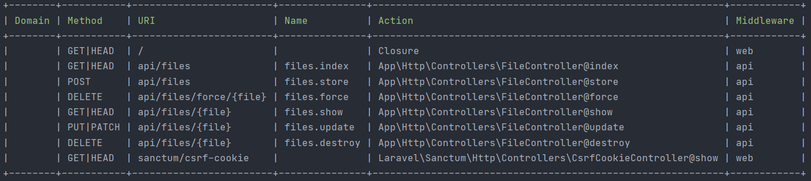
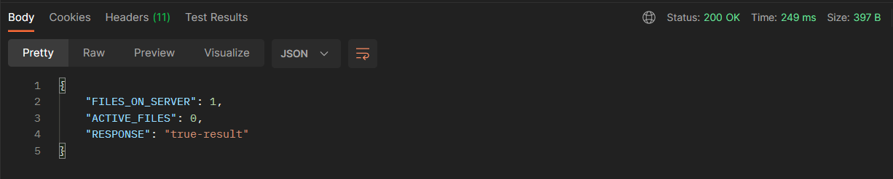
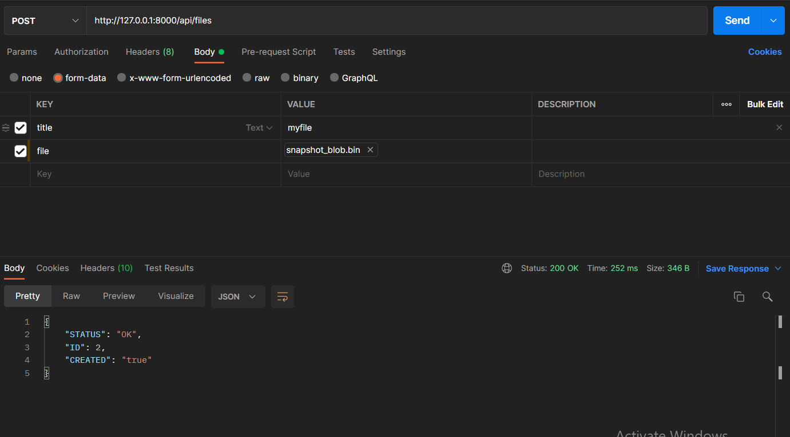
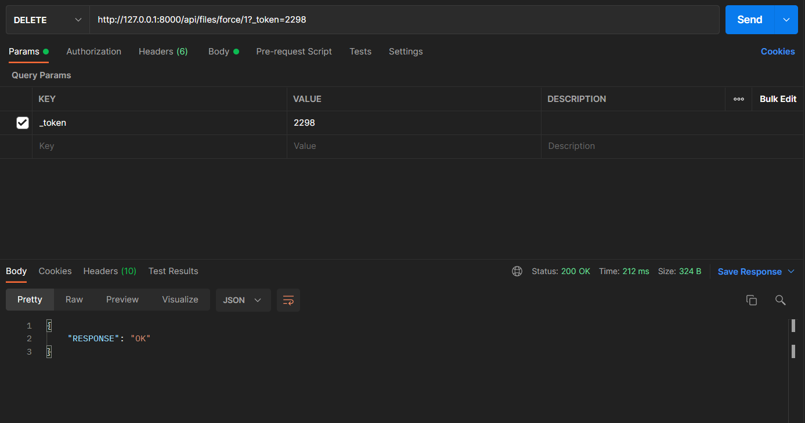

# File-Uploader

File uploader is a simple group of restful APIs built in Laravel to upload file into a server 
and remove the file from that server. 

## Tools
- Using laravel resource controller
- Laravel form request
- Laravel eloquent models
- Laravel restful APIs
- Eloquent soft delete model
- Laravel Storage
- SQLite database

## Routes
All the routes and APIs of our website.<br />


## Postman testing results




## Setup
Clone and go to project directory:<br />
```shell
$ git clone https://github.com/amirhnajafiz/File-Uploader.git
$ cd file-uploader
```

Setup project tools:<br />
```shell
$ composer install
```

After this you should have a <b>Vendor</b> directory and <b>composer.json</b> file.

Then set up the database migration by:<br />
```shell
$ php artisan migrate
```

And set the server up: <br />
```shell
$ php artisan serve
```

You should get a response like this:<br />
```shell
Starting Laravel development server: http://127.0.0.1:8000
[Wed Sep 15 10:31:36 2021] PHP 8.0.7 Development Server (http://127.0.0.1:8000) started
```